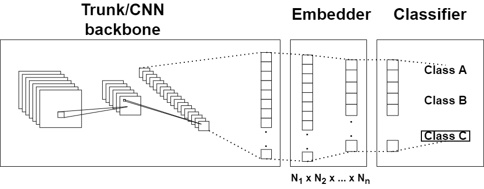

# Metric Learning Cross Validation Pipeline example
Example implementation of a deep metric learning pipeline using the [Pytorch Metric Learning](https://github.com/KevinMusgrave/pytorch-metric-learning) library.

The implementations follows a scientific implementation where a k-fold cross-validation technique is applied.
The pipeline saves the model's performance every fold and generates appropriate figures to show its performance.
During each fold, the model is trained and tested on an initial dataset (training dataset) and then a zero-shot and few-shot process is applied on a secondary dataset.
The training dataset is loaded as filepaths for each image (following the PyTorch image dataset structure) and split into k folds.
Then, for each fold, the zero/few-shot process is applied on the whole secondary dataset.

# Model Structure
The model's structure includes a trunk (the main backbone of the model), the embedder (the embedding extraction part) and the classifier (embedding -> class) that uses a softmax activation layer.



There are some backbone networks already implemented:
* ShallowBackboneEmbeddingNet (a simple 2-layer convolutional network)
* ResnetBackboneEmbeddingNet
* ShufflenetBackboneEmbeddingNet
* InceptionV3BackboneEmbeddingNet
* VGGBackboneEmbeddingNet
* DensenetBackboneEmbeddingNet
* MobileNetV2BackboneEmbeddingNet

An MLP class to create an N-layered MLP network (along with a simple embedder network) and two helper classes for the Trunk-Embedder and Trunk-Embedder-Classifier parts of the network.

A trunk includes the following parameters and is initialized as follows:
```
from networks import ResnetBackboneEmbeddingNet

ResnetBackboneEmbeddingNet(
    model_size=34,          # one of 18, 34, 50, 101, 152 (where applies)
    embedding_size=512,     
    pretrained=True,        
    with_embedder=True,     # whether to include a simple embedding part or not
    trainable_grad_depth=2  # number of conv blocks to enable training (starting from the output layer)
)
```

# Dataset Loader
The dataset is as list of paths-class (dynamically loading the images) so as to split the dataset into folds without loading the whole dataset altogether (PathListDataset).
The images' paths and classes can easily be loaded:
```
from datasets import BaseDataset, PathListDataset
x_paths, y = BaseDataset.walk_dataset("path/to/dataset")
train_indexes, test_indexes = split(x_paths, y)
dataset = PathListDataset(x_paths[train_indexes], y[train_indexes])
```
Also, there's a static method to calculate the running mean and std of the dataset for the Normalize Transform layer (if needed).
```
from torchvision import transforms
from datasets import BaseDataset

mean, std = BaseDataset.calculate_mean_std(
    directory="path/to/dataset",
    transform=transforms.Grayscale()
)
```

# Result processing

## Summarization
The code was initially inteded to experiment and compare the performance of different models on the same datasets, so there are some methods that summarize the results of all the models into a single .csv file.

result_processing.py includes the create_metric_summary and create_summary methods that summarize the results of different models (that exist in the same folder).

## Visualization
utils.py includes the methods that visualize the embeddings generated by the models, generate confusion matrices, plot metric performances and score the model on the dataset.
The code calculates the Accuracy, Precision, Recall and F1-score for comparison puproses.

# Cross-validation
A model can be cross-validated using the cross_validate method as follows:
```
from networks import VGGBackboneEmbeddingNet

cross_validate(
    trunk_obj=VGGBackboneEmbeddingNet,
    trunk_kwargs={
        "model_size": 16,
        "trainable_grad_depth": None
    },
    embedder_layer_sizes=[embedding_size],
    classifier_layer_sizes=[embedding_size, n_classes],
    dataset_dir=train_dataset_dir,
    shot_dataset_dir=shot_dataset_dir,
    train_transform=train_transform, 
    test_transform=test_transform,
    cv=3,
    train_kwargs=train_kwargs,
    fewshot_kwargs=fewshot_train_kwargs,
    results_dir=results_dir
)
```
